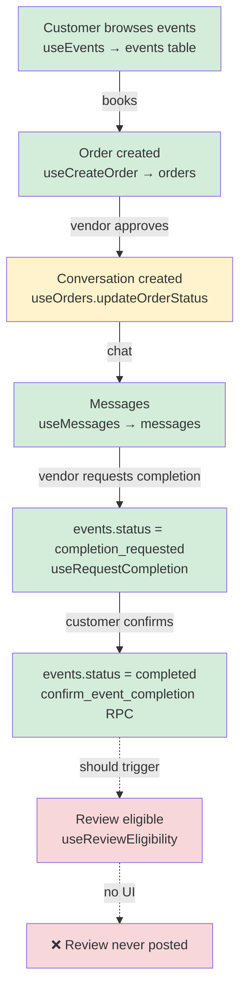

# Dutuk Platform — Full Architecture Audit

> **Audit Date:** 2026-04-12  
> **Scope:** `dutuk-vendor` (React Native / Expo), `dutuk-user` (Next.js), Supabase backend (project `unqpmwlzyaqrryzyrslf`, region `ap-south-1`)

---

## 1. System Overview

Dutuk is a two-sided marketplace connecting **Vendors** (service providers: photographers, caterers, decorators, etc.) with **Customers** who plan events. The platform is split into two separate client apps sharing one Supabase backend.

| App | Stack | Users |
|---|---|---|
| `dutuk-vendor` | React Native + Expo Router | Vendors (mobile) |
| `dutuk-user` | Next.js 14 (App Router) | Customers (web) |
| Backend | Supabase (Postgres + RLS + Realtime) | Shared |

---

## 2. Backend — Database Schema

### 2.1 Core Tables

| Table | Rows (live) | Primary Role |
|---|---|---|
| `events` | 5 | **Dual purpose**: vendor event listings AND confirmed bookings (no distinction) |
| `event_pricing_items` | 7 | Granular pricing lines per event (triggers sync to `events.pricing_summary`) |
| `orders` | 3 | Customer booking requests to vendors |
| `conversations` | 5 | Chat channels between customer and vendor |
| `messages` | 2 | Individual messages within conversations |
| `reviews` | 0 | Customer reviews (table exists, no live data) |
| `companies` | 1 | Vendor company profiles |
| `user_profiles` | 1 | Vendor role records (auto-created on signup) |
| `customer_profiles` | 0 | Customer extended profiles |
| `requests` | 0 | **Legacy**: old direct-booking requests table (never used in active flow) |
| `planned_events` | 2 | **Legacy**: multi-vendor planning parent table (orphaned) |
| `event_inquiry_items` | 0 | **Legacy**: multi-vendor inquiry line items (never populated in production) |
| `dates` | 7 | Vendor calendar availability |
| `portfolio_items` | 1 | Vendor portfolio images |
| `services` | 0 | Service catalogue (secondary to `vendor_services`) |
| `vendor_services` | 0 | Public vendor service packages |
| `categories` | 0 | Category taxonomy (seeded but empty) |
| `favorites` | 0 | Customer saved vendors/services |
| `saved_vendors` | 0 | Duplicate of favorites (two separate tables) |
| `notifications` | 0 | In-app notification log |
| `push_tokens` | 0 | Device push tokens |
| `payments` | 0 | Payment records (not yet in use) |
| `earnings` | 0 | Vendor earnings (derived, empty) |

### 2.2 Key Relationships

```
events (listings/bookings)
  └── event_pricing_items  (1:many — trigger syncs summary back to events)
  └── reviews.event_id     (nullable FK — review attached to event)
  └── payments.event_id    (nullable FK)
  └── earnings.event_id    (nullable FK)
  └── conversations.booking_id   ← LEGACY, always null in practice
  └── conversations.event_id     ← set on 1 of 5 conversations only

orders
  └── conversations.order_id     ← PRIMARY chain link (set on all 5 conversations)

conversations
  ├── order_id     ← actual link (all 5 rows)
  ├── booking_id   ← always null (legacy, intended FK to events)
  ├── event_id     ← set on only 1 row manually
  └── messages     (1:many)

planned_events  [LEGACY]
  └── event_inquiry_items  [LEGACY — 0 rows]
```

### 2.3 Functions & Triggers

| Name | Type | Purpose | Status |
|---|---|---|---|
| `handle_updated_at` | Trigger fn | Auto-sets `updated_at` on all tables | ✅ Active |
| `handle_new_user` | Trigger fn | Creates `user_profiles` row on auth signup (role=`vendor`) | ✅ Active |
| `handle_event_dates` | Trigger fn | Populates `start_date`/`end_date` from date array | ✅ Active |
| `sync_event_pricing_summary` | Trigger fn | Syncs pricing JSONB to events on pricing_items change | ✅ Active |
| `update_event_status` | Manual fn | Auto-transitions events `upcoming→ongoing→completed` by date | ⚠️ Not scheduled (no pg_cron) — called manually only |
| `get_vendor_stats` | RPC | Returns dashboard stats for vendor | ✅ Used by vendor store |
| `get_request_count` | RPC | Counts pending requests by company name | ⚠️ Joins on `company_name` string — fragile |
| `set_vendor_role` | RPC | Upserts user_profiles role to `vendor` | ✅ Used on registration |
| `check_vendor_availability` | RPC | Returns true if vendor has capacity on a date | ⚠️ Only queries `event_inquiry_items` (dead table — always returns true) |
| `create_event_bundle` | RPC | Creates `planned_events` + `event_inquiry_items` rows atomically | ❌ Dead — backed by deprecated tables |
| `confirm_event_completion` | RPC | Customer confirms event complete (SECURITY DEFINER) | ✅ Recently added |

### 2.4 RLS Summary

- All active tables have RLS enabled
- Vendors see only their own events, orders, conversations, messages
- Customers see their own orders and conversations  
- `events` has public read for listings (customers can browse all vendor events)
- `conversations` RLS: accessible by `customer_id = auth.uid()` OR `vendor_id = auth.uid()`

---

## 3. dutuk-vendor App (React Native)

### 3.1 App Overview

A mobile-first vendor management dashboard. Built with Expo Router (file-based routing). Primary state managed by a single Zustand store (`useVendorStore`).

### 3.2 Navigation Structure

```
/app
  ├── (tabs)/
  │     ├── home.tsx        → Dashboard: orders preview, analytics, events, reviews
  │     ├── orders.tsx      → Full orders list (all statuses)
  │     ├── chat.tsx        → Conversations list + navigation to chat thread
  │     ├── profile.tsx     → Vendor profile shortcut
  │     └── calendar.tsx    → Date availability calendar
  │
  ├── orders/
  │     ├── customerApproval.tsx   → Pending order: Accept / Reject
  │     ├── customerDetails.tsx    → Approved/completed order details
  │     ├── allOrders.tsx          → Full filterable order list
  │     └── index.tsx              → (redirects to allOrders)
  │
  ├── event/
  │     ├── index.tsx              → Events list (upcoming, current, past)
  │     └── manage/
  │           ├── createStepOne.tsx   → Event creation step 1: name, dates, images
  │           ├── createStepTwo.tsx   → Event creation step 2: pricing items
  │           ├── create.tsx          → (legacy single-step create)
  │           └── [eventId].tsx       → Event manage/edit screen
  │
  ├── chat/
  │     └── conversation.tsx    → Individual chat thread
  │
  ├── profilePages/             → Settings, portfolio, services, history, etc.
  └── auth/                     → Login, register, onboarding screens
```

### 3.3 State Management

Single Zustand store: `useVendorStore.ts`

| Slice | Contents |
|---|---|
| `company` | Vendor company profile |
| `allEvents` | All vendor events (listing + bookings mixed) |
| `calendarDates` | Availability dates |
| `orders` | All orders (real-time subscription via `useOrders`) |
| `conversations` | Chat conversation list |
| `reviews` / `reviewStats` | Vendor reviews |
| `portfolioItems` | Portfolio images |
| `services` | Service packages |
| `fetchAll()` | Bootstraps all data on app load |

### 3.4 Key Hooks (dutuk-vendor)

| Hook | File | Purpose |
|---|---|---|
| `createEvent` | `createEvent.ts` | Inserts to `events` (no `is_listing` or `source_order_id` — no distinction from bookings) |
| `updateEvent` | `updateEvent.ts` | Updates event fields and pricing |
| `deleteEvent` | `deleteEvent.ts` | Deletes event and pricing items |
| `useOrders` | `useOrders.ts` | Fetches vendor orders + realtime subscription; `updateOrderStatus` → approve/reject |
| `useCompletion` | `useCompletion.ts` | `useRequestCompletion` (vendor sends completion msg) |
| `useMessages` | `chat/useMessages.ts` | Fetches + sends messages; realtime subscribe |
| `useConversations` | `chat/useConversations.ts` | Fetches conversation list |
| `useVendorReviews` | `useVendorReviews.ts` | Read-only fetch of vendor's received reviews |
| `useEventPricing` | `useEventPricing.ts` | CRUD for `event_pricing_items` |
| `usePortfolio` | `usePortfolio.ts` | Portfolio image CRUD + Supabase Storage |
| `useServices` | `useServices.ts` | Vendor service packages CRUD |
| `useEventInquiries` | `useEventInquiries.ts` | Fetches `event_inquiry_items` (dead table — 0 rows) |
| `useAuthenticationState` | `useAuthenticationState.ts` | watches Supabase auth session |

---

## 4. dutuk-user App (Next.js)

### 4.1 App Overview

A web app for customers. Next.js 14 App Router. No global state store — each page/module manages its own state via hooks. Authentication via Supabase SSR client + middleware.

### 4.2 Navigation Structure

```
/app
  ├── (auth)/          → Login, register pages
  ├── (public)/        → Public-facing marketing/browse pages
  ├── (user)/          → Authenticated customer area
  │     ├── chat/      → Conversation list + chat window (ChatScreen + ChatWindow)
  │     ├── bookings/  → (Placeholder — not fully implemented)
  │     └── profile/   → Customer profile
  ├── events/          → Event detail pages (browsing)
  └── middleware.ts    → Route guards (auth redirect logic)

/modules
  ├── auth/            → Login/register forms
  ├── bookings/        → Booking-related components
  ├── chat/
  │     └── user/
  │           ├── ChatScreen.tsx    → Chat orchestrator (confirmation handlers)
  │           └── sections/
  │                 └── ChatWindow.tsx   → Message rendering + CompletionRequestCard
  ├── events/          → Event listing/detail components
  ├── explore/         → Browse vendors / search
  ├── homepage/        → Landing page modules
  ├── vendors/         → Vendor profile display
  └── profile/         → Customer profile components
```

### 4.3 Key Hooks (dutuk-user)

| Hook | File | Purpose | Active? |
|---|---|---|---|
| `useOrders` | `useOrders.ts` | `useCreateOrder` (inserts to `orders`), `useUserOrders` (fetch list), `useOrder` (single) | ✅ Active |
| `useBookingRequest` | `useBookingRequest.ts` | `createRequest` — inserts to legacy `requests` table | ❌ Legacy / dead |
| `useConversations` | `useConversations.ts` | Fetches conversations via `conversations_with_users` view; create conversation | ✅ Active |
| `useMessages` | `useMessages.ts` | Messages CRUD + realtime subscribe | ✅ Active |
| `useCompletion` | `useCompletion.ts` | `useConfirmCompletion` — calls `confirm_event_completion` RPC | ✅ Recently added |
| `useEvents` | `useEvents.ts` | Fetches from `events` table (all rows — listings AND confirmed bookings mixed) | ✅ Active |
| `useFlowEvents` | `useFlowEvents.ts` | Wraps `create_event_bundle`, `check_vendor_availability` RPCs | ❌ Dead — backed by `planned_events` |
| `useReviews` | `useReviews.ts` | `useReviews` (fetch), `useReviewEligibility` (check), `useCreateReview` (insert) | ✅ Hook exists — **no UI in app** |
| `useVendors` | `useVendors.ts` | Browse vendor companies | ✅ Active |
| `useVendorServices` | `useVendorServices.ts` | Fetch vendor service packages | ✅ Active |
| `useVendorAvailability` | `useVendorAvailability.ts` | Check vendor date availability | ✅ Active |
| `useFavorites` | `useFavorites.ts` | Save/unsave vendors | ✅ Active |
| `useSavedVendors` | `useSavedVendors.ts` | Fetch saved vendor list | ✅ Active |
| `useCategories` | `useCategories.ts` | Fetch service categories | ✅ Active (table is empty) |
| `useCustomerProfile` | `useCustomerProfile.ts` | Customer profile CRUD | ✅ Active |
| `useNotifications` | `useNotifications.tsx` | In-app notification feed | ✅ Active |
| `useAuthRedirect` | `useAuthRedirect.ts` | Post-login routing logic | ✅ Active |

---

## 5. Flow Audit: How the App Works End-to-End

### 5.1 Event Listing Creation (Vendor Side)

```
Vendor → createStepOne.tsx
  → fills: event name, description, dates, images
  → createStepTwo.tsx
  → fills: pricing items (fixed / range / custom)
  → calls createEvent()
       → INSERT into events (is_listing not set — no flag exists yet)
       → INSERT into event_pricing_items
       → trigger sync_event_pricing_summary fires → updates events.pricing_summary
  → event appears in vendor's Home "Your Events" section
```

**Issues:**
- No `is_listing` flag — events table mixes listings and confirmed bookings in one pool
- `customer_id` is set to `vendor's own user_id` when creating a listing (wrong semantics)
- `vendor_services` table is the intended catalogue table but it's empty and unused

---

### 5.2 Customer Booking a Vendor (Current State — INCONSISTENT)

There are **two separate, disconnected booking paths** in the user app:

#### Path A: `useBookingRequest` → `requests` table (LEGACY, appears unused in UI now)
```
Customer fills booking form
  → useBookingRequest.createRequest()
  → INSERT into requests (legacy table — 0 rows, vendor app never reads this)
  → No conversation created
  → No notification to vendor
  → DEAD END
```

#### Path B: `useCreateOrder` → `orders` table (ACTIVE, but entry point is unclear)
```
Customer selects vendor / event
  → useCreateOrder.createOrder({ vendorId, eventDate, title })
  → INSERT into orders (status='pending')
  → No conversation created yet
  → Vendor sees order in Orders tab (real-time subscription in useOrders)
```

**Critical issue:** It's unclear from the UI which path is triggered. `useBookingRequest` suggests the old flow still exists in code. Neither path is triggered from the `events` listing page directly — **customers cannot discover and book a vendor through events in the current UI.**

---

### 5.3 Vendor Order Approval Flow

```
Vendor opens Orders tab
  → sees order card with status 'pending'
  → taps → /orders/customerApproval.tsx
  → taps "Approve"
  → useOrders.updateOrderStatus(orderId, 'approved')
       → UPDATE orders SET status='approved'
       → Checks if conversation exists for (customer_id, vendor_id)
            → if no: INSERT conversations (order_id, booking_status='accepted')
            → if yes: UPDATE conversations SET order_id, booking_status='accepted'
       ⚠️ Bug: lookup is by (customer_id, vendor_id) only — not order_id
              → if customer has talked to vendor before, it reuses that conversation
              → does NOT create a new conversation per order
  → Vendor taps "Reject"
  → UPDATE orders SET status='rejected'
  → No conversation created
```

**Issues:**
- Conversation is found/reused by customer+vendor pair, not by `order_id` → **state collision** if customer books same vendor twice
- No event is created automatically when order is approved (the `events` confirmed-booking row is never auto-created)
- No notification sent to customer when order is approved/rejected

---

### 5.4 Chat / Conversation Flow

```
Vendor side:
  → (tabs)/chat.tsx
  → lists conversations from useConversations
  → tap conversation → /chat/conversation.tsx
  → loads messages (useMessages + realtime)
  → vendor can type and send messages
  → vendor can tap "Request Completion" → useRequestCompletion
        → UPDATE events SET status='completion_requested'
        → INSERT message (message_type='completion_request', event_id)

Customer side:
  → (user)/chat/page.tsx → ChatScreen.tsx
  → loads conversations (useConversations + conversations_with_users view)
  → tap conversation → opens ChatWindow
  → sees messages
  → if message_type='completion_request': sees CompletionRequestCard
       → "Confirm Complete" → useConfirmCompletion → confirm_event_completion RPC
             → UPDATE events SET status='completed', completion_confirmed_at=NOW()
       → "Raise Dispute" → toast only (no backend action)
```

**Issues:**
- Customer can initiate a conversation without a prior order (directly via `useConversations.createConversation`) — bypasses the order flow entirely
- `conversations.event_id` is not set when conversation is created (only manually on 1 row)
- No realtime subscription on customer-side conversation list (page refresh required to see new conversations)

---

### 5.5 Event Lifecycle (Full Status Machine)

```
Status values: upcoming → ongoing → completion_requested → completed
                                  ↘ cancelled

CURRENT TRANSITIONS:
  upcoming     → set at creation (vendor creates listing)
  ongoing      → update_event_status() fn (manual call, no pg_cron) or vendor UI
  completion_requested → vendor clicks "Request Completion" in chat
  completed    → customer clicks "Confirm Complete" (via confirm_event_completion RPC)
  cancelled    → currently no UI for this in either app
```

**Issues:**
- `update_event_status()` is not scheduled (commented-out pg_cron block) — dates never auto-transition
- `ongoing` transition can still happen via vendor manage screen (`[eventId].tsx` — `completed` was removed but `ongoing` is still manual)
- No automatic status transition happens on order approval (event not created at all)
- `completion_requested` status is stored in `events` BUT the triggering message's `event_id` is only set correctly if `conversations.event_id` is populated (it often isn't)

---

### 5.6 Review Flow

**Backend:** `reviews` table exists. `useReviews`, `useReviewEligibility`, `useCreateReview` hooks are fully implemented.

**Eligibility logic (in `useReviewEligibility`):**
```
Customer can review IF:
  1. Has an order with vendor (status='approved' AND event_date < today)
  2. Has NOT already reviewed this vendor for this order
```

**Issues:**
- ❌ **No UI exists in `dutuk-user` to post a review** — hooks are there, screens are not
- `useCreateReview` stores `event_id = order_id` (semantic mismatch — it's storing order ID in an event FK column in the reviews table)
- Eligibility check uses `orders.status = 'approved'` but completed events should use the actual `events.status = 'completed'`
- Vendor app shows reviews section on home screen and has `useVendorReviews` hook — but no reviews exist to display (0 rows)

---

## 6. Consolidated Issues Register

### Severity: 🔴 Critical

| # | Issue | Impact |
|---|---|---|
| 1 | `events` table serves as both vendor listing catalogue AND confirmed bookings | Queries in user app (`useEvents`) return all events including private confirmed bookings; listings cannot be distinguished from bookings |
| 2 | `useBookingRequest` writes to dead `requests` table; `useCreateOrder` writes to `orders` — two paths exist in code with unclear which is triggered | Booking requests may silently disappear |
| 3 | Vendor approval creates conversation by `(customer_id, vendor_id)` — not `order_id` | One customer booking a vendor twice reuses the old conversation, losing order context |
| 4 | No event row is auto-created when an order is approved | The booking flow has no confirmed event; `conversations.event_id` is never set; completion flow cannot work reliably |

### Severity: 🟡 High

| # | Issue | Impact |
|---|---|---|
| 5 | Customer can start a chat without placing an order | Order-gated chat is not enforced |
| 6 | `conversations.event_id` is null on 4 of 5 conversations | Completion request message `event_id` FK will be null; completion RPC fails silently |
| 7 | Review UI does not exist | Customers cannot leave reviews; vendor ratings permanently zero |
| 8 | `update_event_status()` is never scheduled | Events stay `upcoming` forever; `ongoing` never auto-sets |
| 9 | `useCreateReview` stores `order.id` in `reviews.event_id` (FK to `events` table) | FK constraint violation if checked; semantic mismatch |

### Severity: 🟠 Medium

| # | Issue | Impact |
|---|---|---|
| 10 | `planned_events` + `event_inquiry_items` + `useFlowEvents` + `create_event_bundle` RPC exist in production but are dead | Dead code in DB and app; confusing for future devs |
| 11 | `requests` table (0 rows) + `useBookingRequest` still present in codebase | Conflicting booking entry points |
| 12 | `saved_vendors` and `favorites` are duplicate tables | Pick one and delete the other |
| 13 | `vendor_services` is empty — vendor catalogue is `events` table instead | Architectural confusion; `events` was not designed as a catalogue |
| 14 | `categories` table is empty — browse/filter by category is broken | No category taxonomy in place |
| 15 | "Raise Dispute" on completion card has no backend action | Shows toast only |
| 16 | No notification sent to customer when order is approved/rejected | Customer has no way to know their booking was accepted |
| 17 | Customer side has no realtime subscription on conversations list | New conversations from vendor approval are not visible without refresh |

### Severity: 🔵 Low

| # | Issue | Impact |
|---|---|---|
| 18 | `handle_new_user` trigger always sets role=`vendor` for every new auth signup | Customer accounts also get `role=vendor` in `user_profiles` |
| 19 | `get_request_count` joins on `company_name` string — not by FK | Fragile; breaks if company name changes |
| 20 | `check_vendor_availability` queries `event_inquiry_items` (dead table) — always returns true | Vendor availability check is non-functional |
| 21 | `payments`, `earnings` tables are empty — no payment system implemented | Payment flow is future work |

---

## 7. What Is Working vs What Is Not

### ✅ Working
- Vendor registration and login (Expo, Supabase Auth)
- Customer registration and login (Next.js, Supabase Auth)
- Vendor creates event listing (2-step flow with pricing)
- Vendor calendar availability management
- Vendor receives orders in real-time (Supabase Realtime subscription)
- Vendor approves/rejects orders (creates conversation on approval)
- Chat messaging between vendor and customer (realtime, both sides)
- Vendor portfolio management (images in Supabase Storage)
- Vendor profile, company info, services management
- Completion request flow (vendor sends → customer confirms via RPC)
- Reviews table + hooks (backend-ready)

### ❌ Not Working / Missing
- Customer cannot discover and book directly from an event listing page
- Review submission (no UI)
- Dispute resolution (stub only)
- Event auto-status transitions (`update_event_status` never scheduled)
- Payment system (tables empty, no integration)
- Notification to customer when order is approved
- Order → Event auto-creation on approval
- Category browsing (empty categories table)
- Cancellation flow (no UI in either app)

---

## 8. Architecture Dependency Map



---

## 9. Quick Reference: Table → Who Reads/Writes

| Table | dutuk-vendor reads | dutuk-vendor writes | dutuk-user reads | dutuk-user writes |
|---|---|---|---|---|
| `events` | ✅ (all own events) | ✅ (create/update/delete) | ✅ (browse listings) | ❌ |
| `orders` | ✅ (own vendor orders) | ✅ (approve/reject) | ✅ (own orders) | ✅ (create) |
| `conversations` | ✅ | ✅ (create on approve) | ✅ | ✅ (create) |
| `messages` | ✅ (realtime) | ✅ | ✅ (realtime) | ✅ |
| `reviews` | ✅ | ❌ | ❌ | ⚠️ (hook exists, no UI) |
| `requests` | ❌ Never | ❌ | ❌ | ⚠️ (legacy hook exists) |
| `planned_events` | ❌ | ❌ | ⚠️ (useFlowEvents, dead) | ⚠️ (dead) |
| `companies` | ✅ | ✅ | ✅ (browse) | ❌ |
| `dates` | ✅ | ✅ | ❌ | ❌ |
| `payments` | ❌ | ❌ | ❌ | ❌ |
